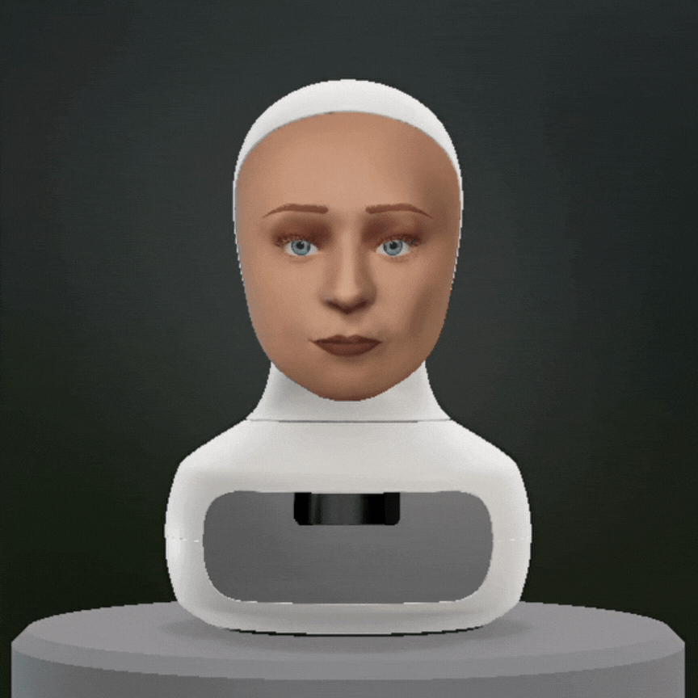
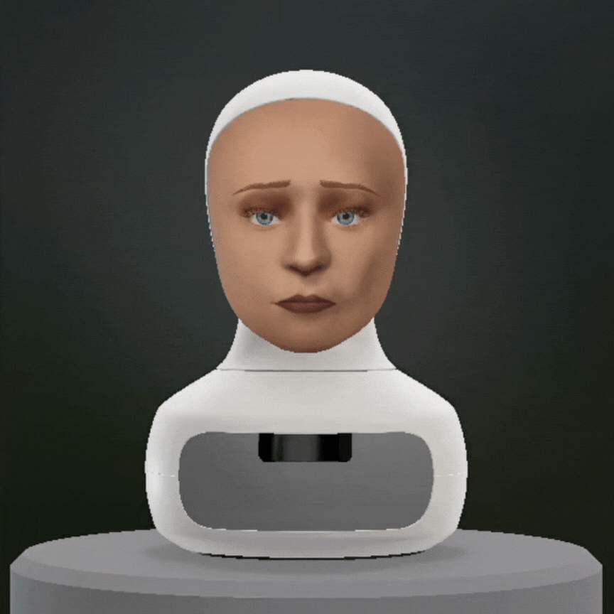

# AIMA - Conversational Robot with Emotion Control

AIMA is an AI-driven conversational robot designed to detect and manage emotional states during interactions. The project leverages state-of-the-art machine learning techniques, including supervised and reinforcement learning, with large language models to predict and generate emotionally coherent responses. The goal is to improve human-robot communication by giving the robot the ability to understand and respond based on the user's emotional state.

## Table of Contents

- [Project Overview](#project-overview)
- [FurhatRobotics](#Furhatrobotics)
- [Datasets](#datasets)
- [Models](#models)
- [Techniques](#techniques)
- [Results](#results)
- [Installation](#installation)

## Project Overview

This project focuses on developing emotion control mechanisms for a conversational robot using Large Language Models (LLMs). The system predicts and generates appropriate emotional responses based on input text, leveraging advanced machine learning techniques such as supervised learning, reinforcement learning, and prompt engineering.

## FurhatRobotics
This project integrates with **Furhat Robotics**, a social robot that has the capability to express emotions and interact naturally with humans through speech and facial expressions. 

By leveraging LLMs, the robot’s emotional intelligence is enhanced to enable more human-like interactions, reacting appropriately to various conversational contexts.

### Example: Furhat Expressing Emotions
Below is an example of Furhat expressing happiness:
<p align="center">
  
  <br/>
  <em>Furhat robot showing a happy facial expression.</em>
</p>

### How the Emotion Control Works:
- **Emotion Prediction**: Based on input conversations, the system predicts emotions and translates them into appropriate facial expressions for Furhat.
- **Emotional Responses**: The robot adjusts its voice, facial expressions, and gestures to reflect emotions such as joy, sadness, surprise, and more.

Another example of Furhat expressing sadness:
<p align="center">
  
  <br/>
  <em>Furhat robot displaying a sad expression.</em>
</p>

## Datasets
This project utilizes the following datasets for emotion prediction and response generation:

1. **IEMOCAP (Interactive Emotional Dyadic Motion Capture)**  
   - **Description**: A multimodal dataset that contains approximately 12 hours of audio-visual data, annotated with emotional labels such as anger, happiness, sadness, and neutrality.  
   - **Source**: [IEMOCAP Dataset](https://sail.usc.edu/iemocap/)  
   - **Format**: Audio, video, and transcripts  
   - **Size**: 12 hours of recordings  
   - **Usage**: Used for training and testing the emotion prediction models by analyzing speech and textual data.

2. **MELD (Multimodal EmotionLines Dataset)**  
   - **Description**: Contains over 13,000 conversational instances extracted from TV show dialogues, annotated with seven emotion labels including anger, disgust, sadness, joy, and surprise.  
   - **Source**: [MELD Dataset](https://github.com/declare-lab/MELD)  
   - **Format**: Textual conversations, with speaker information and emotion labels  
   - **Size**: 1,433 dialogues  
   - **Usage**: Used for fine-tuning models on text-based emotion classification and testing response generation in different emotional contexts.

---

## Models
The following models are used and developed in this project:

1. **Gemma (Emotion-Language Model)**  
   - **Type**: Large Language Model (LLM)  
   - **Description**: A pre-trained LLM used for emotion prediction based on input conversations, employing fine-tuned weights for better emotion response accuracy.  
   - **Usage**: Used as the primary model for emotion classification and generation.

2. **Mistral**  
   - **Type**: Large Language Model  
   - **Description**: Another LLM variant designed for improved context understanding and response generation, fine-tuned on the IEMOCAP and MELD datasets for emotional sensitivity.  
   - **Usage**: Provides a backup to Gemma for testing the robustness of the emotion prediction pipeline.

3. **Llama (Large Language Model Meta AI)**  
   - **Type**: Large Language Model  
   - **Description**: LLaMA is fine-tuned to generate emotional responses in conversations, leveraging retrieval-augmented generation (RAG) and reinforcement learning from human feedback (RLHF).  
   - **Usage**: Responsible for generating emotionally tailored responses during robot interactions, especially after receiving feedback for improvements.

---

## Techniques
- **Prompt Engineering**: Carefully crafted prompts were used to guide LLMs in predicting and generating appropriate emotional responses.
- **Supervised Fine-tuning**: The LLMs were fine-tuned using emotion-labeled datasets to enhance prediction accuracy.
- **Reinforcement Learning from Human Feedback (RLHF)**: Applied to refine the model's ability to generate emotionally coherent responses based on human feedback.

---

## Results
- Achieved **62% accuracy** and a **Weighted F1-score of 58%** for emotion control, which is close to state-of-the-art results.
- The system was validated on the IEMOCAP and MELD datasets to ensure robust emotion prediction and response generation in various conversational contexts.

---


## Installation

To install the project dependencies, clone the repository and run the following command:

```bash
git clone https://github.com/yourusername/AIMA.git
cd AIMA
$ conda activate aima
```
Install the requirement in the requirement.txt file
```bash
$ pip -r install requirements.txt
```
Run the Notenooks on VSCode or JupyterLab.
